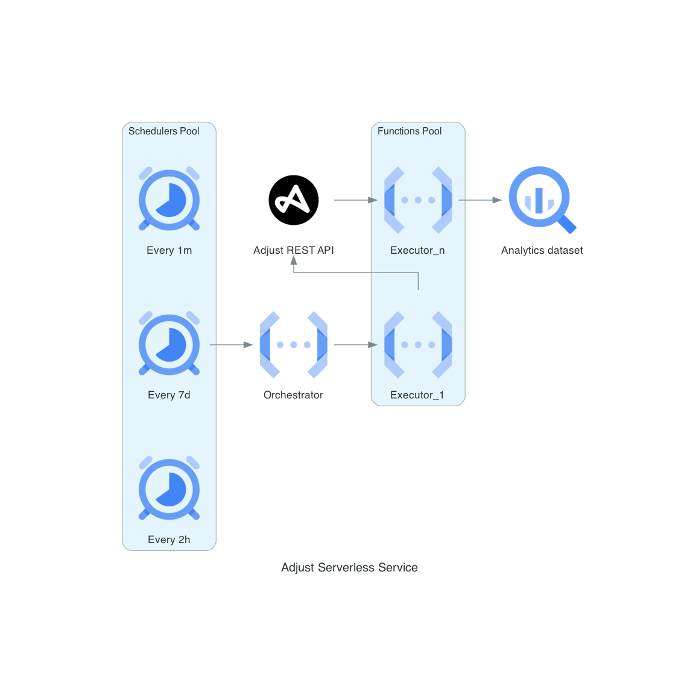

# Adjust Report API Function

| Branch    | Status |
| -------- | ------- |
| Main  |     |
| Developement |      |

## Purpose/Goals

The *Fake Adjust Serverless Service* is a service used to query the Adjust REST API and retrieve the attribution reporting data.
The tool is maintaned by the Data team and it is a refactoring effort from a legacy component handled by the BackEnd team (developed and managed by Ciprian M.).

The project will collect Fake Adjust Report API data at different intervals:

- every 2h
- every week
- every month

This is done because Fake Adust is a data aggregator itself and the velocity of different sources is quite different between each other. Without any warning, some records could be updated and it is necessary to have the most recent view of the data at hand.

The retrieved data is later recorded on BigQuery and sanitized via ELT process.

## Infrastructure design

## Data workflow

- At a fixed interval, a scheduler send a HTTP call to the *orchestrator* Cloud Function.
- The *orchestrator* gets the Adjust API key and the App Token secrets from the Secret Manager.
- According to the schedule, it builds the right type and the right amount of URLs (1, 7 or 30).
- In a "fire-and-forget" fashion, it will send each URL to the *executor* Cloud Function.
- Each URL will create an isolated instance of the *executor* Cloud Function.
- Destination BigQuery dataset and tables are fetched and two consecutive HTTP POST are made to Adjust Report API:
    - one for *ios* platform
    - one for *android* platform
- The returned data is manipulated in Pandas according to the BigQuery table specifics.
- The operation day and timestamp are recorded inside the dedicated lookup table to build the materialized view via Dataform at a later stage.

## Data observability

To be defined with Cloud Logging...

## Testing the pipeline

At the current state, the project is tested via CI/CD pipeline in GitHub. Tests are allocated in _test/_ folder.

Two types of tests are run:

- Unit tests
- End-to-end tests

### Unit testing:

The unit testing of the project occurs at two levels:

- Terraform plan output.
- Python scripts.

These steps are run in parallel at every **push** event on the remote.

### End to end testing:

The E2E testing performed inside the project comprise a dev deployment of the infrastructure in GCP, along with a helping script located in _test/e2e_tests/run_e2e_test.py_ to perform these actions:

- Set up empty tables in *analytics_test* BigQuery dataset.
- Sent a HTTP POST to the *orchestrator* for a 2h scheduled run. It will retrieve the latest data from the Adjust REST API.
- Wait for the Cloud Function to finish and get the results.
- Process and write the results back the BigQuery testing tables.
- Run some basic test to make sure that the tables are not empty and contains data from the running date.

If tests fails, the job fails in the CI/CD pipeline.
